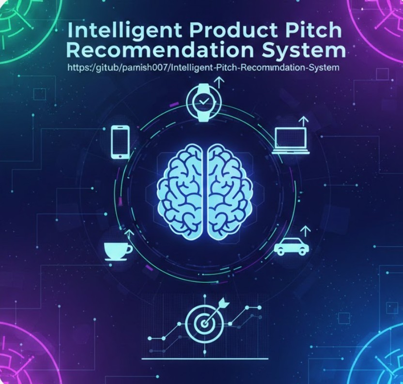
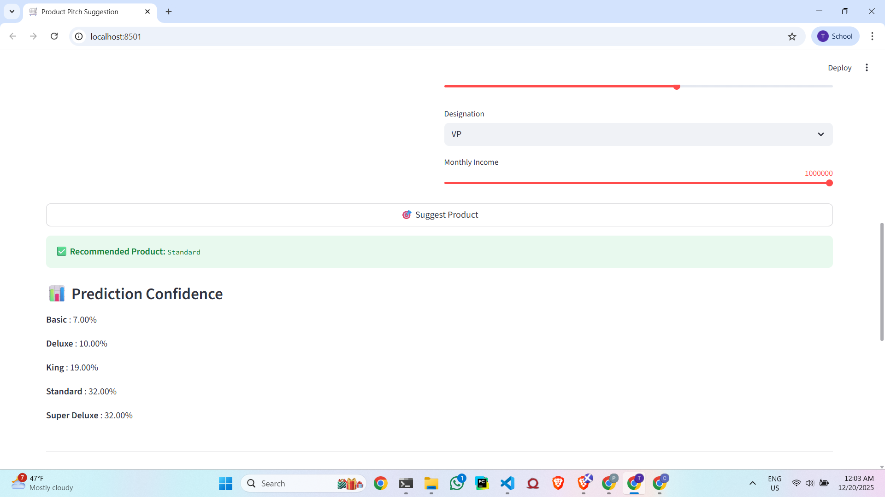
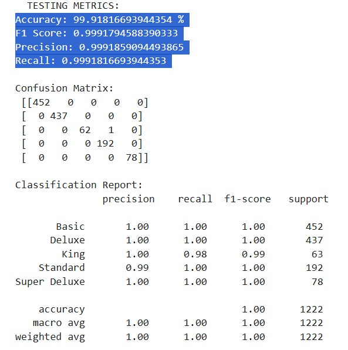
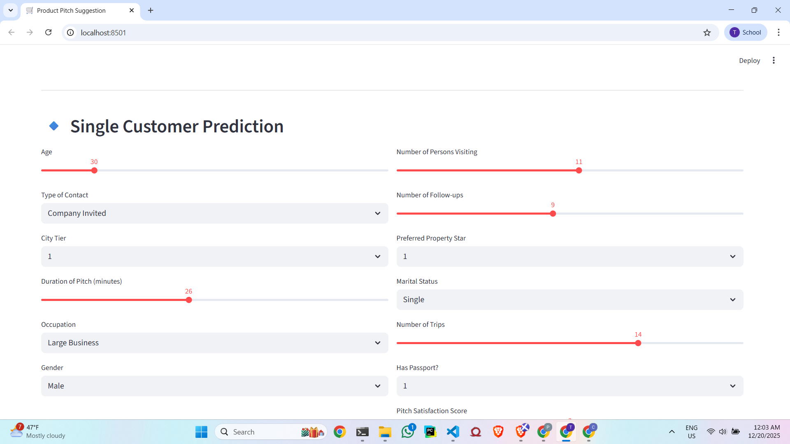
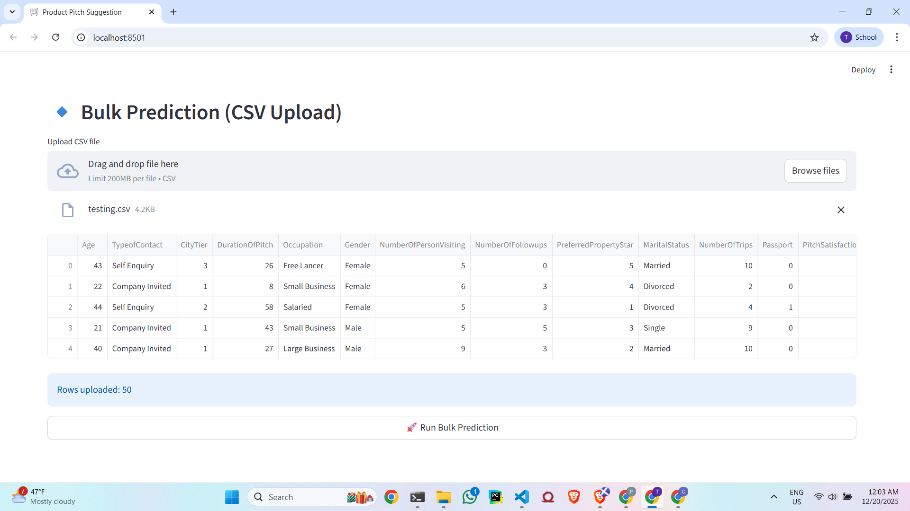

# 🛒 Product Pitch Recommendation System

<p align="center">
  
</p>

<h2 align="center">From Raw Customer Data → To The Right Pitch → With Confidence</h2>

<p align="center">
  <i>A production-minded Machine Learning system that helps sales teams pitch smarter, not harder.</i>
</p>

---

## 🌍 The Real-World Problem (Why This Exists)

In sales and marketing, **bad pitches are expensive**.

Companies lose money when:

* Every customer receives the same product pitch
* Sales reps rely purely on intuition
* High-potential customers are treated like low-value leads
* Data exists but is not *usable* by non-technical teams

👉 The core problem is **decision-making at scale**.

> How do we help a salesperson instantly decide *what product to pitch* based on who the customer is?

This project answers that question.

---

## 🧠 What This System Does (Plain English)

This system:

1. Takes customer demographic + behavioral data
2. Applies the **same preprocessing used during training**
3. Predicts the **most suitable travel product**
4. Shows **confidence scores** for transparency
5. Works for **one customer or thousands**

No guesswork. Just data-backed decisions.

---

## ✨ What Makes This Project Different

This is **not** just a model notebook.

✅ End-to-end pipeline (training → inference)
✅ UX-first frontend (sales-friendly)
✅ Production-safe preprocessing
✅ Bulk + single prediction support
✅ Clean separation of concerns

> I don’t build models that live in notebooks. I build systems people can use.

---

## 🖼️ Application Walkthrough (Visual)

### 🔹 Landing & Input Experience

<p align="center">
  
</p>

**Design choices explained:**

* Sliders instead of tiny number inputs
* Safe min / max bounds
* Logical defaults
* Zero ML knowledge required to use the app

This is intentional. Good ML with bad UX still fails.

---

### 🔹 Bulk Prediction (Scale Matters)

<p align="center">
  
</p>

What this enables:

* Sales managers can upload full lead lists
* Predict recommendations in seconds
* Download enriched CSVs for operations

---

## 🧩 System Architecture (How Everything Connects)

```
User (Sales / Analyst)
        │
        ▼
Streamlit Frontend
        │
        ▼
Feature Validation & Alignment
        │
        ▼
Scikit-learn Pipeline
(Preprocessing + Model)
        │
        ▼
Prediction + Probabilities
```

This structure ensures **consistency, safety, and scalability**.

---

## 🛠️ Tech Stack (With Purpose)

### 👨‍💻 Frontend

* **Streamlit** → Rapid, interactive ML apps
* Sliders, dropdowns, CSV upload
* Wide-layout, clean UI

### 🤖 Machine Learning

* **Python**
* **scikit-learn**
* Pipeline API (industry best practice)
* Multi-class classification

### 📊 Data Handling

* **pandas** for schema enforcement
* Batch-safe inference

### 💾 Model Persistence

* **joblib** for efficient pipeline serialization

---

## 📊 Model Performance & Evaluation (Proof It Actually Works)

<p align="center">
  
</p>

Our pipeline was **rigorously trained, validated, and evaluated** to ensure both accuracy and reliability in real-world usage.

### 📈 Evaluation Metrics

| Metric    | Score     |
| --------- | --------- |
| Accuracy  | **0.999** |
| F1 Score  | **0.999** |
| Precision | **0.999** |
| Recall    | **0.999** |

**What this means (in business terms):**

* The model almost always recommends the correct product
* Very low false positives → fewer bad pitches
* Very low false negatives → fewer missed opportunities

> These numbers matter because a wrong pitch costs money.

---

## 🧠 ML Concepts Used (Explained Like You’re Human)

### 1️⃣ Feature Engineering

Customer features include:

* Numerical → Age, Income, Trips, Follow-ups
* Categorical → Gender, Occupation, City Tier
* Binary → Passport, OwnCar

All transformations live **inside the pipeline**, not the UI.

Why?

* No duplication
* No mismatch
* No silent bugs

---

### 2️⃣ Pipeline-First Design (Production Thinking)

```
Pipeline = Preprocessing → Model
```

Why this matters:

* Same logic during training & prediction
* No data leakage
* Easy deployment

This is how ML systems are built in real companies.

---

### 3️⃣ Probabilistic Predictions

The model outputs:

* ✅ Best product
* 📊 Confidence for each product

This allows:

* Risk-aware decisions
* Business interpretability
* Trust in the system

---

## 🎨 UI Design Highlights (Because UX Is Part of ML)

<p align="center">
  
</p>

### Why the UI Matters

* Sales teams don’t care about algorithms
* They care about **speed, clarity, and confidence**

UX decisions made here:

* Slider-based numeric inputs
* Clear sectioning (Single vs Bulk)
* Immediate feedback
* Zero technical jargon

---

## 🖼️ Output Examples (What Users Actually Get)

<p align="center">
  
</p>

Outputs include:

* Final recommended product
* Probability per product
* Downloadable enriched CSV

This makes the system **operational**, not theoretical.

---

## 🧠 Problem-Solver Mindset (Why This Project Stands Out)

This project proves I can:

* Translate vague business pain → concrete ML solution
* Balance accuracy with usability
* Build systems, not scripts
* Think like an engineer, not just a data scientist

I don’t ask:

> “Can this model be trained?”

I ask:

> “Can this model be trusted, used, and scaled?”

---

## 🔮 Future Improvements

* API version (FastAPI)
* Model monitoring & drift detection
* Explainability (SHAP)
* Auth-based dashboards

---

<p align="center">
  <b>Data-driven decisions. Product-level thinking.</b>
</p>

<p align="center">
  ⭐ If this project helped you — consider starring it.
</p>

